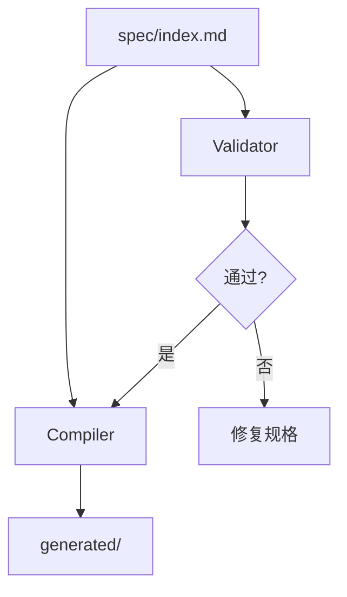

# 系统架构

> 描述系统的高层架构、分层设计和组件关系。所有功能设计必须与本架构一致。

---

## 架构概览

用一段话概括系统的整体架构风格：

<!-- 示例: 本系统采用分层架构，规格层驱动实现层，运行时层通过生成的制品交付 -->

---

## 系统分层

```
[愿景层] — 为什么做（Why）
    │
    ▼
[架构层] — 做什么（What）
    │
    ▼
[功能层] — 怎么做（How）
    │
    ▼
[任务层] — 具体做（Do）
    │
    ▼
[实现层] — 代码 & 制品
```

### 各层职责

| 层级 | 文件                   | 职责           | 变更频率 |
| ---- | ---------------------- | -------------- | -------- |
| 愿景 | `core/vision.md`       | 长期目标和方向 | 极少     |
| 架构 | `core/architecture.md` | 系统结构和约束 | 少       |
| 功能 | `features/*/spec.md`   | 功能设计和接口 | 中等     |
| 任务 | `features/*/tasks.md`  | 实现步骤和状态 | 频繁     |
| 实现 | `generated/`, 源代码   | 代码和制品     | 频繁     |

---

## 核心组件

在此描述系统的主要组件/模块：

<!--
示例:
### 1. 规格引擎（Spec Engine）
- 职责: 解析、验证、编译规格文档
- 接口: CLI + MCP Server
- 依赖: Python 3.8+

### 2. 代码生成器（Code Generator）
- 职责: 从规格生成代码桩、API Schema、测试模板
- 输出: `generated/` 目录
- 依赖: 规格引擎
-->

---

## 架构约束

以下规则不可违反：

1. **功能不得与架构冲突** — 任何功能设计必须符合本文档定义的架构
2. **架构变更需要 ADR** — 修改本文档前，必须先创建 ADR 记录
3. **单向依赖** — 上层可以依赖下层，下层不可上向依赖
4. **接口优先** — 组件间通过明确接口交互，避免隐式耦合

---

## 技术栈

| 类别     | 选择     | 理由                    |
| -------- | -------- | ----------------------- |
| 规格格式 | Markdown | 人类和 AI 都能读写      |
| 工具语言 | Python 3 | 生态丰富，AI Agent 友好 |
| 版本控制 | Git      | 原生支持差异追踪和分支  |

---

## 架构图

<!--
可以用 Mermaid 或 ASCII 绘制:


-->
