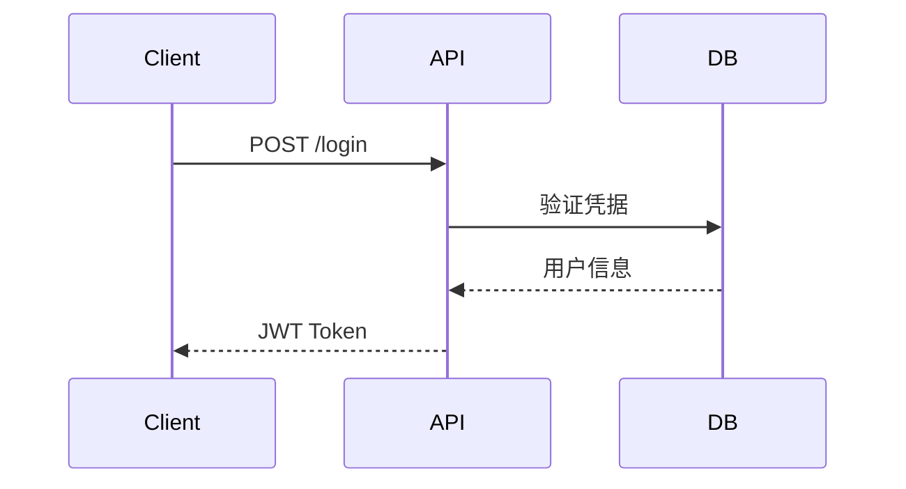

# [功能名称]

> 状态: `draft` | `ready` | `in-progress` | `review` | `done`

---

## 目标

这个功能要解决什么问题？列出 2-5 个具体目标：

- 目标 1
- 目标 2

---

## 非目标

明确列出这个功能**不做**什么，防止范围蔓延：

- 不处理 XXX
- 不支持 YYY

---

## 设计

### 概述

用 2-3 句话概括功能的核心设计。

### 详细设计

描述实现方案，包括数据流、状态变化、核心逻辑等。

<!--
可以使用 Mermaid 图:

-->

---

## 接口

### API 端点

| 方法 | 路径       | 描述     | 请求体              | 响应             |
| ---- | ---------- | -------- | ------------------- | ---------------- |
| GET  | `/api/xxx` | 获取资源 | -                   | `{ data: T }`    |
| POST | `/api/xxx` | 创建资源 | `{ field: string }` | `{ id: string }` |

### 数据模型

```
{
  "id": "string",
  "name": "string",
  "createdAt": "datetime"
}
```

---

## 验收标准

功能完成必须满足以下所有条件：

- [ ] 标准 1: 描述可验证的行为
- [ ] 标准 2: 描述可验证的行为
- [ ] 标准 3: 边界条件处理正确

---

## 约束条件

- 性能: 响应时间 < XXms
- 安全: 需要认证/授权
- 兼容: 需要向后兼容

---

## 依赖

| 依赖项 | 类型     | 状态 |
| ------ | -------- | ---- |
| 功能-A | 功能依赖 | done |
| 服务-B | 外部服务 | 可用 |

---

## 风险

| 风险     | 可能性   | 影响     | 缓解方案 |
| -------- | -------- | -------- | -------- |
| 风险描述 | 高/中/低 | 高/中/低 | 应对方案 |

---

## 边界情况

列出需要处理的边界情况和异常场景：

- 当输入为空时...
- 当并发访问时...
- 当依赖服务不可用时...

---

## 测试策略

### 单元测试

列出需要覆盖的核心逻辑和边界条件：

- 测试用例 1: 描述输入和期望输出
- 测试用例 2: 描述边界情况

### 集成测试

列出需要验证的模块间交互：

- 场景 1: 描述模块交互和期望行为

### E2E 测试（如需要）

列出端到端用户流程：

- 流程 1: 描述用户操作路径和期望结果

### 测试要求

- [ ] 所有 P0 功能有对应的单元测试
- [ ] 关键路径有集成测试覆盖
- [ ] 测试先于实现编写（TDD: Red → Green → Refactor）
- [ ] 测试命名遵循 `test_<行为>_when_<条件>_then_<期望>` 模式

### 波及范围

列出此功能变更时可能受影响的其他模块或功能：

| 受影响模块/功能 | 影响类型 | 需要测试 |
| -------------- | -------- | -------- |
| 功能-A         | 接口依赖 | 是       |
| 模块-B         | 数据依赖 | 是       |

> 此表由波及分析工具自动参考，也可手动补充。详见 `spec/workflow/impact-analysis.md`
